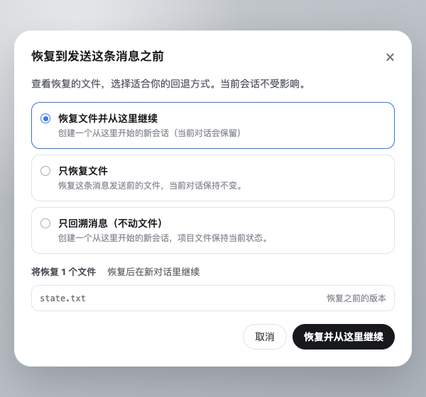

# DSH Turn Rewind

[](https://x.com/anion_ex)

[English](README.md)

为 DeepSeek Harness 提供 Turn 级项目文件恢复，并可选择从恢复后的这一轮继续新对话。

**Turn Rewind** 是用户看到的功能名、仓库名和 Profile Bundle 名。**Change Ledger** 是底层持久恢复引擎；`ctx.changeLedger` 服务、磁盘格式和存储路径继续保留这个名字，因为它们描述的是可复用的快照与恢复层，而不只是 Web 上的回退按钮。

它给 DSH Session 增加一条明确的安全边界：

```text
创建恢复点
    ↓
Agent / 用户 / 外部程序修改工作树
    ↓
预览逐路径变化
    ↓
审阅全部或部分恢复计划
    ↓
在回退弹窗中按下最终恢复按钮
    ↓
先建救援点 → 恢复 → 哈希验证
```

插件**不会**自动 commit、stash、reset、切分支、修改 Git index，也不会替用户判断某项改动“应该回滚”。

## 效果预览

每条用户消息下方依次显示时间、DSH 原生“复制”和第三个纯图标“回退”：


打开后会先展示受影响文件，可选择“恢复文件并从这里继续”“只恢复文件”或“只回溯消息（不动文件）”：



## 为什么底层需要 Change Ledger

普通 Git 面板可以展示当前 diff，但不拥有完整、持久的恢复生命周期。Change Ledger 独立负责：

- 内容寻址的恢复点 manifest；
- Git worktree、HEAD、分支和进行中 Git 操作的状态围栏；
- 从审阅到执行之间的 stale plan 检测；
- 短期确认码与 DSH 人工批准双门槛；
- 每次恢复前自动建立救援点；
- 恢复后的内容哈希验证；
- 恢复失败后的自动回滚；
- DSH 重启时对未完成操作日志进行对账；
- 可供其他插件依赖的 `ctx.changeLedger` 公共服务。

持久格式见 [docs/FORMAT.md](docs/FORMAT.md)，安全与故障模型见 [SECURITY.md](SECURITY.md)。

## 安全契约

- **只做显式操作：**任何恢复都不会自动发生——每一次恢复都从用户在 Web 弹窗中按下最终按钮开始，或来自对服务 API 的显式调用。
- **先读后写：**弹窗预览基于当前工作树生成短期、会话绑定的计划，不修改任何文件。
- **人工门禁：**弹窗中审阅受影响文件并按下最终恢复按钮就是人的决定；没有实时会话绑定计划对的直接修改请求一律 fail closed。
- **先救援再修改：**恢复任何文件前，先持久化当前 eligible tree 的救援点。
- **不静默漏文件：**遇到 submodule、sparse checkout、超限文件、总量超限或特殊文件类型时，创建恢复点直接失败。
- **不允许路径逃逸：**所有持久路径必须是规范的工作树相对路径；恢复拒绝穿过 symlink 父目录，也拒绝覆盖非空目录。
- **不覆盖审阅后的新变化：**执行时重新检查所选路径，以及审阅过的 HEAD、分支和 Git 操作状态；任何相关变化都会使计划失效。
- **不碰 Git 控制面：**index、分支、HEAD、stash 和 commit 均保持原样。

## 支持范围

`0.1` 只支持普通 Git worktree：

- tracked 文件，包括恢复点创建时已经缺失的 tracked 路径；
- 未被 `.gitignore` 或 Git 标准 excludes 忽略的 untracked 文件；
- 文本和二进制普通文件；
- 符号链接；
- 可执行位等可移植权限位。

下列对象会被拒绝或明确排除：

- sparse checkout；
- submodule gitlink（应分别进入每个 submodule 建恢复点）；
- ignored 文件；
- socket、设备、FIFO 等特殊文件；
- 扩展属性、ACL、所有者、时间戳和 hard-link 拓扑；
- Git index 和仓库元数据；
- 非 Git 目录。

如果 ignored 或其他未受管理的文件占据了待恢复路径，插件会拒绝恢复，不会递归删除它。

## 安装

```sh
pnpm install --frozen-lockfile
pnpm run check

dsh plugin --profile web add @anionex/dsh-turn-rewind
dsh plugin --profile headless add @anionex/dsh-turn-rewind

dsh --profile web --dump-config | grep turn-rewind
```

修改 Profile Bundle 后需要重启对应 DSH 进程。

本仓库是标准 DSH Profile Bundle：`package.json` 声明 `dsh.bundle.patch`，`cordis.patch.yml` 直接挂载 `@anionex/dsh-turn-rewind`，不修改 DSH 主仓库。

当 Profile 同时提供 DSH Agent 服务时，插件会在每轮第一次 `agent/pre-step`、Agent 开始处理用户消息之前保存隐藏文件状态。保存失败只会让该消息无法回退，不会拦住用户这一轮。Web Profile 还会提供同源 `/turn-rewind` 接口：根据所选 `user/message` 序号找到对应状态，分页返回文件预览，生成短期、会话绑定的恢复授权，并把新对话创建交给 DSH 官方 Host create/fork 生命周期。插件绝不会自动恢复文件。

## 使用流程

在 Web Profile 中，每条用户消息下方都会在时间和原生“复制”之后显示一个紧凑、无文字的**回退**图标，提示是“恢复到发送这条消息之前”。图标使用明确的向后/撤销箭头，而不是“重试”圆形箭头。打开后会检查保存的文件状态，先显示简洁预览，需要时可“查看全部文件”，并提供三种模式：

| 模式 | 代码 | 对话 |
| --- | --- | --- |
| **恢复文件并从这里继续**（文件有变化时的默认） | 自动备份当前状态后恢复项目文件。 | 创建一个从这里开始的新会话（当前对话会保留）。 |
| **只恢复文件** | 自动备份当前状态后恢复项目文件。 | 当前 Session 保持原位且内容不变。 |
| **只回溯消息（不动文件）**（无检查点或文件无变化时的默认） | 项目文件保持当前状态，不做任何修改。 | 创建一个从这里开始的新会话，并把原消息文字填入输入框。 |

弹窗和最终主按钮就是确认流程，不再要求重复勾选。文件会按实际结果显示为“恢复之前的版本”“找回文件”“移除后来新增的文件”“恢复文件权限”或“恢复之前的文件类型”。**只回溯消息**始终可用——即使该消息没有保存检查点、检查点被跳过（例如在设置里关闭了自动检查点），或项目文件已经与保存状态一致——因为它完全不触碰工作区，也不会被同一工作区中其他运行中的 Agent 阻止。

真正修改前，Turn Rewind 会再次检查所选文件和项目版本状态，并先创建自动备份。预览后出现的新变化会让本次恢复失效。同一工作树只要还有正在运行的 Agent（包括当前来源 Session），恢复就会被阻止；仅处于空闲状态的 Session 不会阻止恢复。已经审阅过的 HEAD 或分支变化不会阻止恢复：commit、分支、HEAD 和 index 都保持不变，恢复后的内容可能表现为当前 HEAD 上的未提交修改。Git 正在合并、变基等操作时仍会阻止。如果“恢复文件并从这里继续”在创建新对话时失败，Change Ledger 会自动从备份恢复操作前的文件。

DSH Session 日志只追加不改写，因此“恢复文件并从这里继续”和“只回溯消息”都会创建新 Session，而不是截断原对话。选中第一条消息时，Host 会在同一目录创建空 Session；选中后续消息时，会在上一轮 `turn/end` 处分叉。只有所选 `user/message` 和对应的精确 `turn/start` 都低于每一层持久 `seedLength` 时，子 Session 才能复用祖先保存的状态；子 Session 自己的状态优先，兄弟分支绝不混用。**Turn Rewind** 的两个维度彼此独立：两个“恢复文件”模式会修改项目文件（可选随后创建新对话），而**只回溯消息**复用同一分叉生命周期但完全不碰文件。原 Session 始终保留。

## 配置

运行时可调选项可以直接在 DSH Web 设置页的**插件 → Turn Rewind**卡片（`turn-rewind` 设置命名空间）中修改，修改对下一次捕获、恢复或删除即时生效，并持久化到宿主 `settings.yaml`，优先级高于下方 patch 层配置。`storageDir` 刻意不在此处暴露：存储根目录在引擎持有锁与 journal 时不可移动，只能通过 patch 层配置。

在 Profile 的 patch 层覆盖组合基线（以及 `storageDir`）：

```yaml
- id: turn-rewind
  config:
    storageDir: ~/.dsh/change-ledger/v1
    maxRestorePoints: 50
    maxTurnCheckpointsPerSession: 30
    maxFiles: 20000
    maxFileBytes: 16777216
    maxSnapshotBytes: 536870912
    planTtlMs: 900000
    staleLockMs: 30000
    turnCheckpointMode: legacy   # off | git-native | legacy；off 表示不创建文件检查点
    turnCheckpointTimeoutMs: 5000
    turnCheckpointMaxNewBytes: 33554432
    turnCheckpointTrust: fast    # fast | strict
```

把 `turnCheckpointMode` 设为 `off`（patch 层或设置卡均可）后，插件不再为每条消息自动创建文件检查点，而是记录持久跳过标记；回退弹窗对这些消息仍然提供**只回溯消息**。

所有容量与用户恢复点数量限制都采用 fail loud。自动 Turn 检查点使用独立的每会话保留窗口，并且只清理自己最旧的检查点；用户和救援恢复点永远不会被静默删除。未配置时，`storageDir` 使用 `$DSH_HOME/change-ledger/v1`，未设置 `DSH_HOME` 时回退到 `~/.dsh/change-ledger/v1`；它不得与被管理 worktree 重叠。

## 检查点管理

同一张设置卡内置存储管理器，由同源 `/turn-rewind/manage` 端点支撑。它列出该存储根下跟踪过的所有工作区——包括目录已被删除的项目——并按项目分组显示检查点数量、近似占用和待处理恢复徽标。支持按单个检查点、按项目或全局（一键清空）删除未受保护的恢复点并回收不再引用的 blob。仍被未完成的恢复 journal、进行中的恢复或未完成的 Git-native publish 引用的恢复点会被保留并明确报告。Git-native（v2）检查点内容存放在仓库的 Git 对象库中，其磁盘空间由 Git 自身的垃圾回收释放；界面显示的大小为逻辑值。

## 故障恢复

任何路径写入前，插件都会先创建救援点和持久 operation journal。如果 DSH 在非终态操作期间退出，下次启动会把该操作标记为 `interrupted`；如果另一个仍存活的 DSH 进程持有工作树锁，则不会误判其操作。

恢复通过公开的 `ctx.changeLedger` 服务 API 进行：用 `listRecovery` 找到操作的 `rescuePointId`，用 `inspect` 审阅该救援点，再对相关路径走 `planRestore`/`applyRestore`。救援点在被显式删除前始终是普通、可检查的恢复点。

## 公共服务

其他 Cordis 插件可以注入 `changeLedger`，直接调用结构化 API：

```ts
export const inject = ['changeLedger']

export async function apply(ctx: Context) {
  const point = await ctx.changeLedger.create({
    cwd: '/absolute/git/worktree',
    sessionId: 'session-id',
    label: 'before refactor',
  })
  // point.id 是持久恢复点 ID。
}
```

完整格式类型从 `@anionex/dsh-turn-rewind/format` 导出；可信集成和测试可以从 `@anionex/dsh-turn-rewind/core` 使用独立 Engine。

## 开发

```sh
pnpm install --frozen-lockfile
pnpm run check
```

测试会创建真实的临时 Git 仓库，覆盖全部/部分恢复、stale plan、ignored 路径冲突拒绝、HEAD 变化、救援回滚、崩溃对账、活动锁保护、持久状态完整性、symlink、容量限制、sparse checkout、submodule、删除和 blob GC。

## 关于

DSH Turn Rewind 由 [anionex](https://anionex.me/) 维护。如果你想了解我后续的更多工作，欢迎在 [X](https://x.com/anion_ex) 或 [GitHub](https://github.com/Anionex) 关注我。

## 许可证

BSD-3-Clause，见 [LICENSE](LICENSE)。
